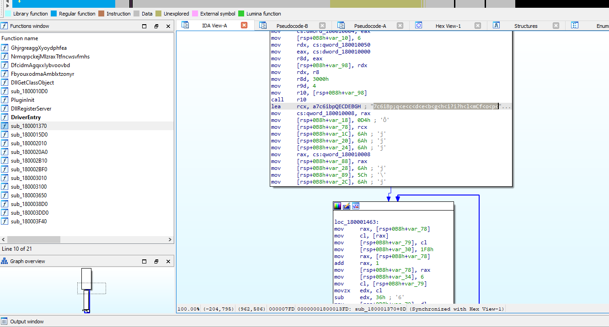
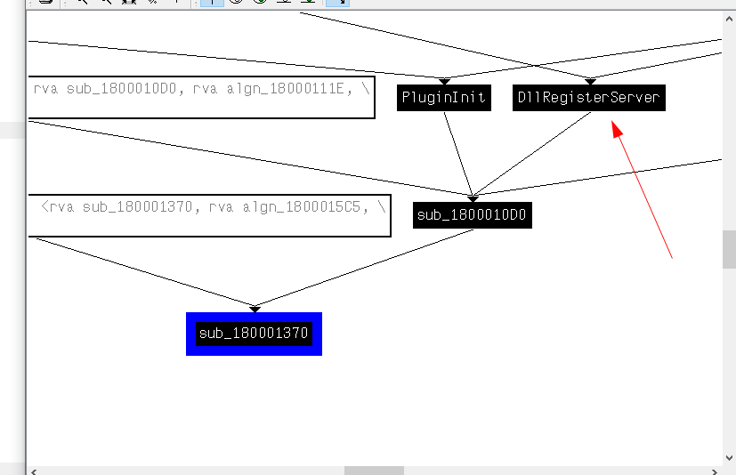

# Write-up
## ICEDID
**In this writeup I will share my detailed analysis for IcedID malware.**
### Basic Info

| File type                     | DriverDLL
| SHA-256                       | 33cc3816f98fa22354559711326a5ce1352d819c180be4328a72618d20a78632
| File size                     | 62.38 KB (63880 bytes)
| Sample                        | https://bazaar.abuse.ch/sample/33cc3816f98fa22354559711326a5ce1352d819c180be4328a72618d20a78632/
| VirusTotal                    | https://www.virustotal.com/gui/file/33cc3816f98fa22354559711326a5ce1352d819c180be4328a72618d20a78632

### Advanced Static Analysis
On the first look on the sample it has a `DriverEntry` which does nothing

After looking on exports and doing some analysis, I found that this function is used to decrypt a data that looked like an executable file but encrypted

Viewing XREFS to find a proper instruction to start calling the decryption function I used this because it has the most functionality of the driver


### Advanced Dynamic Analysis
To dump the dropped executable we need to move to dynamic analysis and step over the decryption function

Dumping this data, I got the dropped file

## Dropped File Analysis

### Basic Info

| File type                     | DLL
| SHA-256                       | 9ff5c9ce0d1536ce8b043b10758453e3349a82cc31195ca57250a272e65b4da4
| VirusTotal                    | https://www.virustotal.com/gui/file/9ff5c9ce0d1536ce8b043b10758453e3349a82cc31195ca57250a272e65b4da4

### Advanced Static Analysis
on the first look on dropped file, It's a DLL and it calls `CreateThread` with a `StartAddress` as a parameter which has the whole functionally of the malware


taking a deeper look there is a lot of WinApis that are related to network connections


doing some analysis I noticed the decryption process of a potential C2 server


and I've created this python script for the decryption process
```python
import struct
data = [0x0DB, 0x0D9, 0x0F9, 0x0DF, 0x05, 0x074, 0x056, 0x01B,0x04D, 0x04F, 0x0AE, 0x01B, 0x056, 0x0D, 0x052, 0x09C,0x05C, 0x073, 0x0AB, 0x05, 0x094, 0x04E, 0x0EF, 0x0E3,0x0B, 0x08C, 0x0C1, 0x0ED, 0x0D0, 0x02, 0x05A, 0x0FB,0x07, 0x06, 0x0FC, 0x048, 0x09C, 0x09, 0x0A8, 0x05,0x0B8, 0x0B, 0x04A, 0x012, 0x0BB, 0x04E, 0x06D, 0x090,0x05D, 0x0D0, 0x06D, 0x09F, 0x0E, 0x09B, 0x0EB, 0x04A,0x0AA, 0x015, 0x0EE, 0x017, 0x0C, 0x0CC, 0x0B0, 0x087,0x0B6, 0x085, 0x051, 0x0C9, 0x077, 0x011, 0x020, 0x07E,0x029, 0x02E, 0x0C0, 0x068, 0x022, 0x07B, 0x02B, 0x0B2,0x03E, 0x01A, 0x0CF, 0x05, 0x0CB, 0x0B1, 0x065, 0x03D,0x018, 0x06E, 0x0D7, 0x017, 0x04A, 0x0CC, 0x0D6, 0x09B,0x038, 0x0B2, 0x042, 0x017, 0x0FA, 0x0B0, 0x0E5, 0x0A0,0x055, 0x039, 0x07D, 0x0C6, 0x0E3, 0x075, 0x063, 0x047,0x0C, 0x0FA, 0x0BF, 0x03C, 0x01F, 0x043, 0x094, 0x063,0x09E, 0x054, 0x03A, 0x0F6, 0x0A8, 0x0D2, 0x06B, 0x0CB]
res = bytearray()

def decrypt_data(data):
    decrypted_data = []
    for i in range(32):
        decrypted_byte = data[i] ^ data[i + 64]
        decrypted_data.append(decrypted_byte)
    return decrypted_data

decrypted_data = decrypt_data(data)
for i in range(4):
    res.append(decrypted_data[i])
    
print("Campaign ID:",struct.unpack("<I", res[:4])[0])
decrypted_string = ''.join(chr(b) for b in decrypted_data)
print("C2:",decrypted_string[4:19])

decrypt_data(data)
```
output:
```
Campaign ID: 380132461
C2: revedanstvy.bid
```

### advanced dynamic analysis

moving to dynamic analysis for better understanding..

After the decryption it will call another function that will try to reach `aws.amazon.com` probably to test connection

Then will gather a cookie with the Campaign ID as shown here


_Cookie: __gads=380132461_

Also after some stepping there are more intersting data being added to that cookie


_Cookie: __gads=380132461:0:7072:120; _gat=10.0.1337.64; _ga=1.591523.2020557398.296; _u=464C415245:454C4A6F4F6B6572:32424538374241453432333036464332; __io=21_2941567468_1821201458_2357033311; _gid=400849BBD93A_

I noticed that each field of this cookie is actually gained from different function calls that are used to get info about our machine

And a quick analysis for this, this is how they are mapped

_I've named each function of these with the type of info they return depending on the called function in them_

> The cookie value will change from time to time and from machine to another because all the gathered information in this cookie is gained from our machine's info so it's not static of course to all users or runs
{: .prompt-warning }

This data will be used alongside with the C2 server in the same function that was used for the amazon server that is responsible to connect to that C2 and waits for response


_The flow is described in image_

As the server is down we can't take the proper jump that from static analysis we know that it's responsible for writing a file to the system in `c:\\ProgramData\\`{: .filepath} that will probably be the second stage of the malware which will be downloaded from the C2 server


## CAPA Results

### Initial Sample

ATT&CK Tactic          | ATT&CK Technique
-----------------------|-------------------------------------------------------------------
EXECUTION              | Shared Modules T1129


MBC Objective               | MBC Behavior
----------------------------|-------------------------------------------------------------------
CRYPTOGRAPHY                | Hashed Message Authentication Code [C0061]
DISCOVERY                   | Code Discovery::Enumerate PE Sections [B0046.001]
PROCESS                     | Create Thread [C0038]
                            | Resume Thread [C0054]


Capability                                           | Namespace
-----------------------------------------------------|---------------------------------------
authenticate HMAC                                    | data-manipulation/hmac
implement COM DLL                                    | executable/pe
create thread                                        | host-interaction/thread/create
resume thread                                        | host-interaction/thread/resume
access PEB ldr_data                                  | linking/runtime-linking
enumerate PE sections (2 matches)                    | load-code/pe
parse PE header                                      | load-code/pe
resolve function by parsing PE exports (2 matches)   | load-code/pe


### Dropped Sample

ATT&CK Tactic          | ATT&CK Technique
-----------------------|-------------------------------------------------------------------
DEFENSE EVASION        | Obfuscated Files or Information T1027
DISCOVERY              | Account Discovery T1087
                       | File and Directory Discovery T1083
                       | System Information Discovery T1082
                       | System Owner/User Discovery T1033
EXECUTION              | Shared Modules T1129


MBC Objective               | MBC Behavior
----------------------------|-------------------------------------------------------------------
ANTI-BEHAVIORAL ANALYSIS    | Debugger Detection::Anti-debugging Instructions [B0001.034]
COMMUNICATION               | HTTP Communication::Create Request [C0002.012]
                            | HTTP Communication::Get Response [C0002.017]
                            | HTTP Communication::Read Header [C0002.014]
                            | HTTP Communication::WinHTTP [C0002.008]
DATA                        | Encode Data::XOR [C0026.002]
                            | Non-Cryptographic Hash::FNV [C0030.005]
DEFENSE EVASION             | Obfuscated Files or Information::Encoding-Standard Algorithm [E1027.m02]
DISCOVERY                   | File and Directory Discovery [E1083]
                            | System Information Discovery [E1082]
FILE SYSTEM                 | Create Directory [C0046]
                            | Writes File [C0052]
PROCESS                     | Create Thread [C0038]
                            | Terminate Process [C0018]


Capability                                           | Namespace
-----------------------------------------------------|---------------------------------------
execute anti-debugging instructions (2 matches)      | anti-analysis/anti-debugging/debugger-detection
initialize WinHTTP library                           | communication/http
read HTTP header                                     | communication/http
prepare HTTP request                                 | communication/http/client
receive HTTP response                                | communication/http/client
encode data using XOR (2 matches)                    | data-manipulation/encoding/xor
hash data using fnv                                  | data-manipulation/hashing/fnv
implement COM DLL                                    | executable/pe
get common file path (3 matches)                     | host-interaction/file-system
create directory                                     | host-interaction/file-system/create
write file on Windows (2 matches)                    | host-interaction/file-system/write
get hostname (2 matches)                             | host-interaction/os/hostname
terminate process                                    | host-interaction/process/terminate
get session user name                                | host-interaction/session
get user security identifier (2 matches)             | host-interaction/session
create thread                                        | host-interaction/thread/create
link function at runtime on Windows (5 matches)      | linking/runtime-linking
parse PE header                                      | load-code/pe

## Conclusion

### Key Findings:

1. **Initial Sample Analysis**:
   - **File Type**: DriverDLL
   - **SHA-256**: `33cc3816f98fa22354559711326a5ce1352d819c180be4328a72618d20a78632`
   - The initial sample's `DriverEntry` function decrypts an embedded executable, which is subsequently dropped and executed.

2. **Dropped File Analysis**:
   - **File Type**: DLL
   - **SHA-256**: `9ff5c9ce0d1536ce8b043b10758453e3349a82cc31195ca57250a272e65b4da4`
   - The dropped DLL employs several WinAPIs related to network connections, indicating its intent to communicate with external servers.

3. **Decryption Process**:
   - We identified and decrypted a potential Command and Control (C2) server address embedded within the dropped file.
   - The decrypted C2 address: `revedanstvy.bid`

4. **Dynamic Analysis**:
   - The malware attempts to establish an internet connection, initially testing with `aws.amazon.com`.
   - It then gathers machine-specific information, forming a complex cookie value used in communications with the C2 server.
   - Observed cookie example: `__gads=380132461:0:7072:120; _gat=10.0.1337.64; _ga=1.591523.2020557398.296; _u=464C415245:454C4A6F4F6B6572:32424538374241453432333036464332; __io=21_2941567468_1821201458_2357033311; _gid=400849BBD93A`

5. **Behavioral Observations**:
   - The malware awaits further instructions from its C2 server to proceed with additional stages of its attack, which likely include downloading and executing further payloads.
   - Due to the C2 server being down, the malware's next steps, which involve writing a file to `c:\\ProgramData\\`, could not be fully observed.

## Indicators of Compromise (IOCs)

1. **File Hashes**:
   - Initial Sample: `33cc3816f98fa22354559711326a5ce1352d819c180be4328a72618d20a78632`
   - Dropped File: `9ff5c9ce0d1536ce8b043b10758453e3349a82cc31195ca57250a272e65b4da4`

2. **C2 Server**:
   - `revedanstvy.bid`

3. **Network Indicators**:
   - Initial test connection: `aws.amazon.com` (legitimate server)
   - C2 Communication patterns involving complex cookie values:
     - Example Cookie: `__gads=380132461:0:7072:120; _gat=10.0.1337.64; _ga=1.591523.2020557398.296; _u=464C415245:454C4A6F4F6B6572:32424538374241453432333036464332; __io=21_2941567468_1821201458_2357033311; _gid=400849BBD93A`

4. **File Paths**:
   - Potential dropped file path: `c:\\ProgramData\\`

